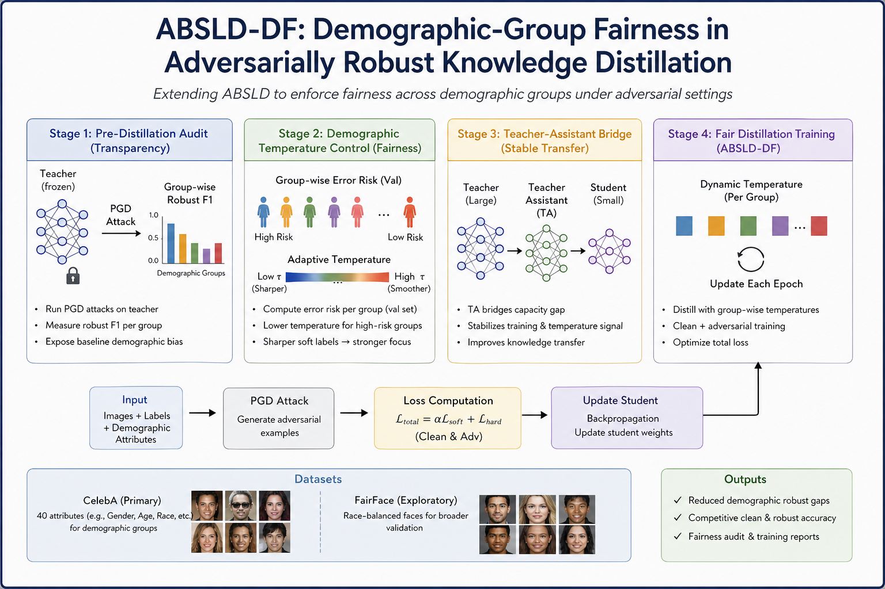

# Ethics-of-AI
Spring 2026 - CS621 Project



This repository contains experiments on robust and fair classification for CelebA-based binary prediction (target: `Smiling`) under clean and adversarial settings, including teacher training and distillation pipelines.

## What this project does

- Trains robust image classifiers (teacher/student variants) with PGD-based adversarial training.
- Evaluates clean and robust performance.
- Audits fairness metrics across multiple sensitive attributes.
- Supports teacher-to-student distillation experiments.

## Repository layout

```text
Ethics-of-AI/
├── README.md
├── requirements.txt
├── config.py                # Unified configuration for all experiments
├── main-teacher.py          # Entry point: teacher model training
├── main-distil.py           # Entry point: knowledge distillation training
├── kd_trainer.py            # Distillation loss and training logic
│
├── core/                    # Shared training/attack/metric logic
│   ├── attacks.py
│   ├── trainer.py
│   ├── kd_trainer.py
│   └── metrics.py
│
├── data/                    # Data loading (single source of truth)
│   ├── celeba.py
│   └── data.ipynb
│
├── checkpoints/             # Saved model checkpoints
├── docs/                    # Project documentation
└── assets/                  # Images/diagrams for README
```

## Key modules to modify

If you want to change behavior, start from these files:

1. `config.py` (root level)
   - Update dataset/checkpoint paths (`DATA_DIR`, `CHECKPOINT_DIR`)
   - Change hyperparameters (`EPOCHS`, `LEARNING_RATE`, `EPSILON`, attack steps)
   - Change fairness target/sensitive attributes (`TARGET_ATTR`, `SENSITIVE_ATTRS`)

2. `core/trainer.py`
   - Controls teacher training and evaluation loops
   - Clean vs robust evaluation behavior
   - PGD schedule usage during training

3. `core/kd_trainer.py`
   - Distillation loss behavior and teacher-student objective

4. `core/attacks.py`
   - PGD attack settings and normalization path

5. `core/metrics.py`
   - Fairness metrics definitions and subgroup gap computation

6. `data/celeba.py`
   - Dataset loading, transforms, split logic, and sensitive-attribute extraction

## Code organization

The codebase now uses a **single source of truth** for all shared modules:
- `core/` contains all training, attack, and metrics logic used by both teacher and distillation pipelines.
- `data/` contains all data loading and preprocessing.
- `config.py` (root) unifies all configuration.
- Entry points (`main-teacher.py`, `main-distil.py`) import from root-level modules.

This eliminates duplication and ensures consistent behavior across experiments.

## Data expectations

The dataloader expects the following files under `Config.DATA_DIR`:

```text
<DATA_DIR>/
├── img_align_celeba/
├── list_attr_celeba.csv
└── list_eval_partition.csv
```

Default path is `celeba-data/` in the project root. Update `DATA_DIR` in `config.py` if your dataset is elsewhere.

## Installation

From the repository root:

```bash
pip install -r requirements.txt
```

## Running experiments

Run from the project root directory so imports resolve correctly.

### 1) Train teacher model

```bash
python main-teacher.py
```

Optional flags:
- `--resume` : Resume from last checkpoint
- `--epochs N` : Train for N epochs (overrides config)

```bash
python main-teacher.py --resume --epochs 30
```

### 2) Train distilled student model

```bash
python main-distil.py
```

The distillation script loads a pre-trained teacher checkpoint. Update `TEACHER_PATH` in `main-distil.py` if using a different checkpoint.

## Reproducibility checklist

- Confirm `DATA_DIR` and `CHECKPOINT_DIR` in `config.py`.
- Confirm `TEACHER_PATH` in `main-distil.py` points to a valid checkpoint.
- Run both scripts from the project root directory.
- Log output will include clean/robust accuracy and fairness metrics at each epoch.
- Checkpoints are saved in `CHECKPOINT_DIR` (default: `./checkpoints/`).

## Minimal development workflow

1. Update paths and hyperparameters in `config.py`.
2. Run `python main-teacher.py` to train the teacher model.
3. Inspect printed clean/robust/fairness metrics.
4. Update `TEACHER_PATH` in `main-distil.py` to point to the trained checkpoint.
5. Run `python main-distil.py` to train the distilled student.
6. Compare fairness metrics between teacher and student.

## Team

| Name | Roll No |
|---|---|
| Parv Thacker | 25210095 |
| Sankalp Turankar | 25210115 |
| Smrutee Behera | 25250041 |
| Balbir Prasad | 25210034 |
